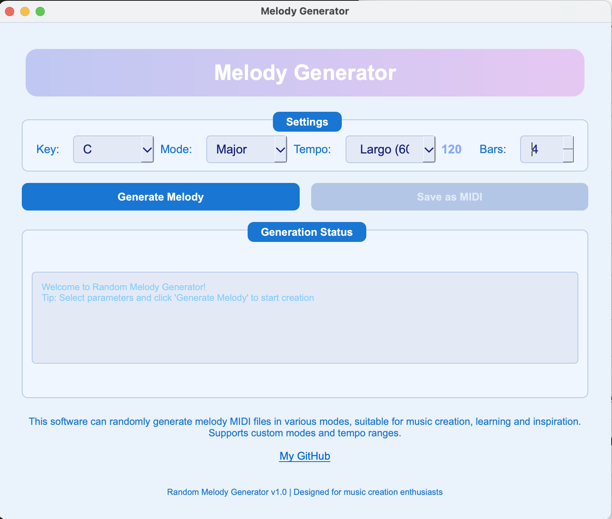

# Random Melody Generator

A Python-based application that generates random melody MIDI files using various musical scales and modes. Perfect for music composition, learning, and creative inspiration.



## Features

- **Multiple Musical Modes**: Generate melodies in 11 different scales including Major, Minor, Pentatonic, and modal scales (Dorian, Phrygian, Lydian, etc.)
- **Customizable Parameters**:
  - Key selection (all 12 keys with sharps)
  - Scale/mode selection
  - Tempo presets (Largo 60 BPM, Andante 90 BPM, Allegro 120 BPM)
  - Measure length (1-16 bars)
- **Intelligent Melody Generation**:
  - Applies musical rules for natural-sounding melodies
  - Controls melodic contour and leap sizes
  - Implements proper voice leading
- **Professional GUI**: Built with PyQt5 with smooth animations and intuitive controls
- **MIDI Export**: Save generated melodies as standard MIDI files

## Download & Installation

### Option 1: Standalone Application (Recommended)

**macOS Users:**
- Download the `.dmg` file from the releases section
- Double-click to mount the disk image
- Drag the application to your Applications folder

**Windows Users:**
- *Coming soon in next update* - Check back for the `.exe` installer

### Option 2: Run from Source Code

#### Prerequisites

- Python 3.7 or higher
- pip (Python package manager)

#### Installation Steps

1. **Clone or download the repository**
   git clone https://github.com/yiyangbear/melody-generator.git
   cd melody-generator

2. **Install dependencies**
   pip install -r requirements.txt

3. **Run the application**
   python src/main.py


## Usage

1. **Select Parameters**:
   - Choose the key (tonic note)
   - Select a musical mode/scale
   - Pick a tempo preset
   - Set the number of measures

2. **Generate Melody**:
   - Click "Generate Melody" to create a new composition
   - The status log will show generation progress

3. **Save Results**:
   - Use "Save as MIDI" to export your melody
   - MIDI files can be opened in any DAW or music notation software

## Supported Scales

- Major
- Natural Minor
- Harmonic Minor
- Pentatonic Major
- Pentatonic Minor
- Dorian
- Phrygian
- Lydian
- Mixolydian
- Aeolian
- Locrian

## For Developers

### Building from Source

#### macOS Application

To build the macOS application bundle:

python scripts/build_mac_app.py

This will create a standalone `.app` bundle in the `dist` folder.

#### Creating DMG for Distribution

After building the app, create a distributable DMG:

python scripts/create_dmg.py

### Dependencies

All Python dependencies are listed in `requirements.txt`:

```
mido>=1.2.10
PyQt5>=5.15.0
python-rtmidi>=1.4.0
```

## Technical Details

### Algorithm Features

- **Scale Construction**: Based on the chosen *key* and *mode*, the program builds a pitch set using predefined scale patterns.  
   Example: `C Major → [60, 62, 64, 65, 67, 69, 71, 72]` (in MIDI note numbers)
- **Note Sequence Generation**: - Each measure contains a fixed number of notes (default: 4).  
   - For each note, the algorithm decides whether to move **stepwise** (to a neighboring pitch) or **jump** to a random note, based on probability.  
   - The duration (`120` or `240` ticks) and velocity (`80–110`) are also randomized to ensure dynamic variation.
- **Rhythmic Patterns**: Balanced, syncopated, and legato rhythm types
- **Musical Rules**: Avoids excessive repetition, controls interval leaps, and ensures proper resolution

## System Requirements

### For Standalone Application:
- **macOS**: 10.14 or later
- **Windows**: *Coming soon*
- **RAM**: 512MB minimum
- **Storage**: 100MB free space

### For Source Code Version:
- **OS**: Windows, macOS, or Linux
- **Python**: 3.7+
- **RAM**: 512MB minimum
- **Storage**: 50MB free space

## Troubleshooting

### Common Issues

1. **Application won't start (macOS)**:
   - If you see "App can't be opened," right-click and select "Open"
   - Go to System Preferences → Security & Privacy → Allow apps from identified developers

2. **MIDI playback not working**:
   - Ensure you have a MIDI player or DAW installed
   - Generated files are standard MIDI format compatible with most software

3. **Import errors (source version)**:
   - Verify all required packages are installed: `pip install -r requirements.txt`
   - Check Python version compatibility

4. **Generation fails**:
   - Try reducing the number of measures
   - Ensure sufficient disk space for temporary files

## Contributing

Feel free to fork this project and submit pull requests for any improvements. Suggestions for additional scales, generation algorithms, or UI enhancements are welcome.

## Future Improvements
- **Chord Progression Support**: Add harmonic context to melodies through algorithmic chord generation.
- **Motif Development**: Implement thematic variation and repetition to create more musical phrases.
- **Rhythm Pattern Generation**：Introduce rhythmic templates for more diverse groove structures.
- **AI-Driven Composition**： Explore Markov chains or Transformer-based models for intelligent melody synthesis.

## License

This project is open source and available under the MIT License. See the `LICENSE` file for details.

## Support

For issues and questions, please check the GitHub repository or contact me.

---

*Version 1.0 | Designed for music creators, educators, and enthusiasts* 🎵

**Note**: Windows executable (.exe) will be available in the next update. Currently available as macOS .dmg and Python source code.
